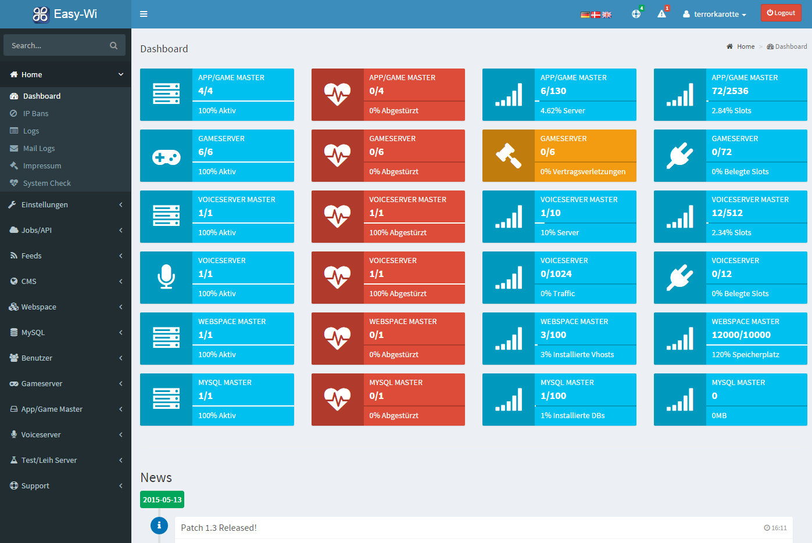

# Easy-Wi

[](assets/img/gallery/dashboard.png)

## Service administration

Being a hoster requires a webinterface that eases your daily work. Also clans and sponsoring projects do not want to give up the comfort a webinterface can bring them.

## Quick start

### Stable Installer (Debian <8, Ubuntu <16.10 only)
```sh
LATEST_VERSION=`wget -q --timeout=60 -O - https://api.github.com/repos/easy-wi/installer/releases/latest | grep -Po '(?<="tag_name": ")([0-9]\.[0-9]+)'`
wget -O installer.tar.gz https://github.com/easy-wi/installer/archive/$LATEST_VERSION.tar.gz
tar zxf installer.tar.gz && mv ./installer-*/easy-wi_install.sh ./
rm -r installer.tar.gz installer-*/
bash easy-wi_install.sh
```

### Unstable Installer (Debian 9>, Ubuntu 17.10> and CentOS 7>)
```sh
wget https://raw.githubusercontent.com/easy-wi/installer/master/easy-wi_install.sh
bash ./easy-wi_install.sh
```

## What to expect

* Responsive design for all kinds of screens and devices, designed to serve in a user-friendly way.
* Easy-Wi can manage various services like Teamspeak 3 and game servers in a distributed fashion.
* Services can be monitored and auto restart on crash activated
* Using Symlinks for shared files decreases the game server installation to a few seconds. Using symlinks will reduce the disk usage for each server to a few Megabytes instead of many Gigabytes.
* Webspace can be managed for various webservers like Apache2, Nginx, etc.
* Independent or in combination with the webspace MySQL or MariaDB can be managed.
* A CMS to manage your pages and news.

## Support Channel
Discord: [Easy-WI Discord Channel](https://discord.gg/quJvvfF)

Gitter: [Easy-WI Gitter Channel](https://gitter.im/easy-wi/Lobby?utm_source=share-link&utm_medium=link&utm_campaign=share-link)